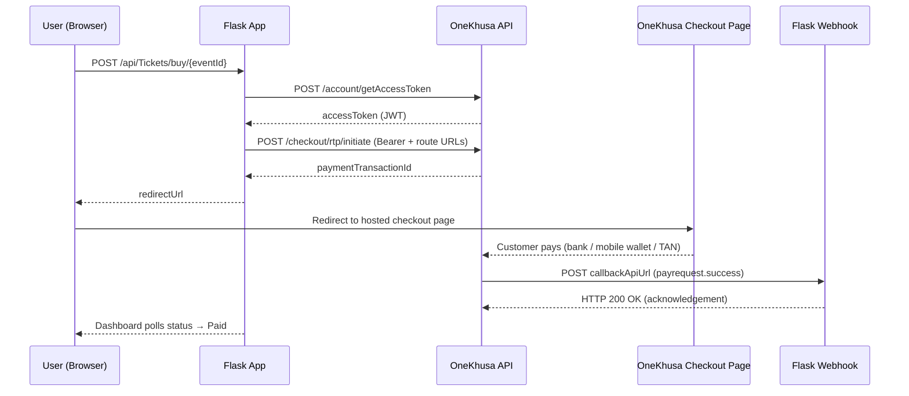
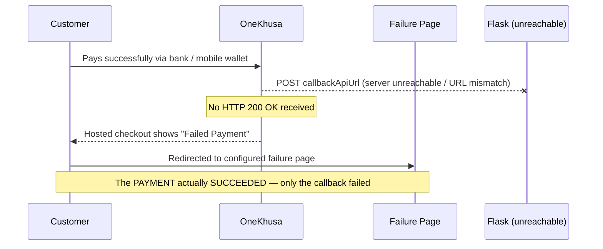

# OneKhusa Hosted Checkout — Python (Flask)

A clean, config-driven **Flask** integration with the **OneKhusa Payment Gateway** (sandbox) that demonstrates the complete **Hosted Checkout** payment flow — including what happens when the **callback URL is not reachable**.

This is the Python counterpart of the [`onekhusa-laravel-integration`](https://github.com/GarryBalala/onekhusa-laravel-integration) project, mirroring its architecture with the same routes and behaviour.

> **In short:** a customer buys a ticket on your page → is redirected to OneKhusa's hosted checkout → pays via a TAN → OneKhusa confirms the payment to your server over a webhook → the customer sees the success page.

---

## Table of Contents

1. [Features](#-features)
2. [How It Works](#-how-it-works)
3. [Prerequisites](#-prerequisites)
4. [Quick Start](#-quick-start)
5. [Project Structure](#-project-structure)
6. [Configuration](#-configuration)
7. [API Endpoints](#-api-endpoints)
8. [Webhook & Callback Setup](#-webhook--callback-setup)
9. [When the Callback Is Not Reachable](#-when-the-callback-is-not-reachable)
10. [Troubleshooting](#-troubleshooting)
11. [Security Notes](#-security-notes)

---

## ✨ Features

| Capability | How it's implemented |
| ---------- | -------------------- |
| **Service-oriented** | All OneKhusa API logic lives in `services/onekhusa_service.py` |
| **Config-driven** | Every credential & endpoint is read from `.env` via `config.py` — no hardcoded values |
| **Authenticated API calls** | Obtains a short-lived JWT (`/account/getAccessToken`) and sends it as `Authorization: Bearer` |
| **Token caching** | Access tokens are cached for 240s to avoid hitting the token endpoint on every request |
| **Idempotent requests** | Every call sends an `X-Idempotency-Key` header |
| **Webhook handling** | Confirms payments and always acknowledges with HTTP 200 |
| **Status polling** | The dashboard polls a lightweight endpoint backed by an in-memory status cache |

---

## 🧠 How It Works



**Step by step:**

1. Your app calls the OneKhusa **initiate** endpoint with an `X-Idempotency-Key` and a `route` object containing three URLs:
   - **success redirection URL** — where the customer goes after a successful callback.
   - **failure redirection URL** — where the customer goes when the callback fails.
   - **callback API URL** — where OneKhusa sends the server-to-server payment notification.
2. OneKhusa returns a **payment transaction ID**, and your app redirects the customer to the **OneKhusa Hosted Checkout** page.
3. The customer completes the payment (a **TAN** is used for verification).
4. OneKhusa sends a **server-to-server POST** to your **callback API URL**. Your server **must** reply with **HTTP 200 OK** to confirm receipt.
5. Only then does the flow complete and the customer is redirected to the **success page**.

> 💡 The same flow applies no matter the stack — this demo just happens to use Flask.

---

## 📋 Prerequisites

- **Python 3.10+** installed
- A **OneKhusa sandbox account** (credentials from the merchant portal)
- **ngrok** (or another public tunnel) so OneKhusa can reach your local server for webhooks

---

## 🚀 Quick Start

### 1. Install dependencies

```bash
python -m venv venv

# Windows
venv\Scripts\activate
# macOS / Linux
source venv/bin/activate

pip install -r requirements.txt
```

### 2. Configure your environment

Copy the template and open it:

```bash
cp .env.example .env     # Windows: copy .env.example .env
```

Fill in the **sandbox credentials issued to you in the OneKhusa merchant portal** (see [Configuration](#-configuration)):

```env
ONEKHUSA_API_KEY=your_api_key
ONEKHUSA_API_SECRET=your_api_secret
ONEKHUSA_ORG_ID=your_org_id
ONEKHUSA_MERCHANT_NUMBER=your_merchant_number

PUBLIC_CALLBACK_URL=https://your-id.ngrok-free.dev
```

### 3. Start the app

```bash
python app.py
# or
flask --app app run --port 8080
```

Open **http://localhost:8080** in your browser. The dashboard should load.

### 4. (Required for payments) Start ngrok

In a **second terminal**:

```bash
ngrok http 8080
```

Copy the `https://...ngrok-free.dev` URL into `PUBLIC_CALLBACK_URL` in `.env`, then **restart the app**. Without this, OneKhusa cannot deliver webhooks and the checkout will show a failure (see [When the Callback Is Not Reachable](#-when-the-callback-is-not-reachable)).

### 5. Try the flow

1. On the dashboard click **Generate** for a reference (or type your own).
2. Enter an **Amount** and a **Description**, then click **PURCHASE WITH HOSTED CHECKOUT**.
3. You'll be redirected to the **OneKhusa Hosted Checkout** page — complete the sandbox payment (a **TAN** is provided).
4. You'll return to `/?ref=...`, the syncing overlay appears, and **Payment Verified!** shows once the webhook marks the status `Paid`.

> 👀 Watch the app terminal for `OneKhusa webhook received` and `status updated to PAID`.

---

## 📂 Project Structure

```text
onekhusa-python-integration/
├── app.py                        # Flask app — routes + webhook handler (controllers)
├── config.py                     # Config-driven settings, loaded from .env
├── status_cache.py               # Tiny TTL cache backing status polling
├── services/
│   ├── __init__.py               # Package marker
│   └── onekhusa_service.py       # All OneKhusa API logic
├── templates/
│   └── welcome.html              # Hosted checkout dashboard (Jinja2)
├── requirements.txt              # Python dependencies
├── .env                          # Your credentials — never commit this
├── .env.example                  # Template for .env
└── README.md
```

---

## 🔧 Configuration

All settings live in `.env` and are read by `config.py`.

| Variable | Purpose | Where to find it |
| -------- | ------- | ---------------- |
| `ONEKHUSA_API_KEY` | Sandbox **API key** | Merchant portal → **API / Credentials** |
| `ONEKHUSA_API_SECRET` | Sandbox **API secret** | Merchant portal → **API / Credentials** |
| `ONEKHUSA_ORG_ID` | **Organisation ID** | Merchant portal → **Organisation / Account settings** |
| `ONEKHUSA_MERCHANT_NUMBER` | **Merchant account number** | Merchant portal → **Merchant / Accounts** |
| `PUBLIC_CALLBACK_URL` | Public URL for redirects + webhooks | Your ngrok URL in development |
| `PORT` | App port (default `8080`) | — |
| `FLASK_DEBUG` | Enable/disable debug mode (`1`/`0`) | — |

> ⚠️ Always use **your own** portal values. Never commit `.env` — it's already in `.gitignore`. If a key is ever exposed, rotate it in the merchant portal.

---

## 🔌 API Endpoints

| Method | Endpoint | Description |
| ------ | -------- | ----------- |
| `GET`  | `/` | Hosted checkout dashboard |
| `POST` | `/api/Tickets/buy/{eventId}` | Initiate a hosted checkout. Body: `reference`, `amount`, `description`. Returns the `redirectUrl` to the hosted checkout page. |
| `GET`  | `/api/Tickets/status/{reference}` | Poll the status of a checkout reference. |
| `POST` | `/api/webhooks/payments` | OneKhusa event endpoint (`payrequest.success`). Must reply `200 OK`. |

**Example — initiate a checkout:**

```bash
curl -X POST http://localhost:8080/api/Tickets/buy/event123 \
  -H "Content-Type: application/json" \
  -d '{"reference":"OT-PY-123","amount":2500,"description":"OneTicket"}'
```

```json
{
  "status": "success",
  "reference": "OT-PY-123",
  "paymentTransactionId": "J_s4o6miAtYxJ96ov4quBKhjgS-mbBe...",
  "redirectUrl": "https://checkout.onekhusa.com/requestToPay/initiate?ptid=J_s4o6miAtYxJ96ov4quBKhjgS-mbBe..."
}
```

**Statuses** are cached per reference: `Pending` → `Paid` | `Failed` | `NotFound`.

---

## 📡 Webhook & Callback Setup

1. Your app must be publicly reachable — run **ngrok** as shown in [Quick Start](#-quick-start).
2. Make sure `PUBLIC_CALLBACK_URL` in `.env` matches your current ngrok URL.
3. The app builds these URLs automatically when it initiates a checkout:
   - Success: `PUBLIC_CALLBACK_URL/?ref={reference}`
   - Failure: `PUBLIC_CALLBACK_URL/?ref={reference}&failed=1`
   - Callback: `PUBLIC_CALLBACK_URL/api/webhooks/payments`

When OneKhusa sends a `payrequest.success` event to `/api/webhooks/payments`, the app:

1. Resolves your `reference` from the payload.
2. Marks the status `Paid` (or `Failed`) in the cache.
3. Replies **HTTP 200 OK** so OneKhusa doesn't retry.

---

## ⚠️ When the Callback Is Not Reachable

This is the most important scenario to understand.

**The customer completes the payment successfully** — but OneKhusa cannot reach your **callback API URL** (wrong URL, no tunnel, server down):



**The key point:** the payment itself was successful. The **failure page** is shown because OneKhusa could not deliver the confirmation to your server.

> 🚨 **A successful payment and a successful callback are two separate parts of the flow.** The callback endpoint must be reachable **and** must acknowledge with `HTTP 200 OK` for the checkout to complete successfully.

### Callback URL Checklist

If the checkout shows **Failed Payment** even though the customer paid, verify:

1. ✅ The URL is **correct** (matches your ngrok URL in `.env`).
2. ✅ It uses **HTTPS**.
3. ✅ It is **publicly accessible** (not `localhost`).
4. ✅ It **accepts POST requests**.
5. ✅ It **returns `HTTP 200 OK`** after receiving the notification.

OneKhusa **cannot reach a callback running only on `localhost`** — use ngrok to expose your local app through a public HTTPS URL.

---

## 🔍 Troubleshooting

### Are you a customer seeing "Failed Payment"?

- The payment may still have **succeeded** — keep the confirmation from your bank / mobile wallet.
- **Keep your reference number / TAN** and any transaction details.
- **Contact support** and provide the reference.
