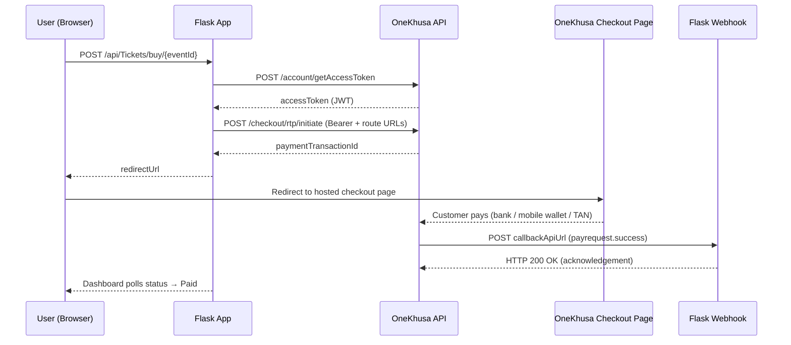
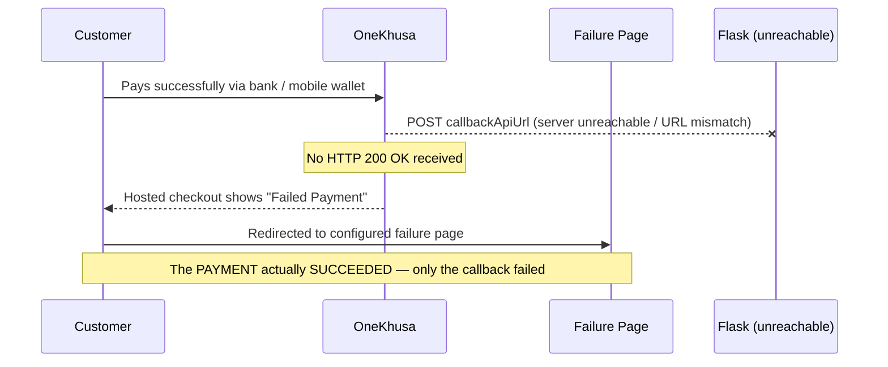

# OneKhusa Hosted Checkout — Python (Flask)

A small, config-driven **Flask** app that demonstrates the complete **Hosted Checkout / Request-to-Pay** flow against the **OneKhusa Payment Gateway (sandbox)** — including the failure mode that catches most people out: **what happens when your callback URL isn't reachable.**

**The flow in one line:** a customer buys a ticket on your page → is redirected to OneKhusa's hosted checkout → pays using a TAN → OneKhusa notifies your server over a webhook → your page shows *Payment Verified*.

> **TAN (Timed Account Number)** — a short-lived account number OneKhusa generates for a single transaction. The customer pays into it from their bank or mobile wallet, and it expires after a short window. See the [OneKhusa docs](https://docs.onekhusa.com/api-reference/get-started/quick-integration) for the current expiry period.

This is the Python counterpart of [`onekhusa-laravel-integration`](https://github.com/GarryBalala/onekhusa-laravel-integration) — same routes, same architecture, same behaviour.

> ⚠️ **Sandbox only.** This is a teaching sample, not production code. See [Security Notes](#-security-notes) before you reuse any of it.

---

## Table of Contents

1. [Features](#-features)
2. [How It Works](#-how-it-works)
3. [Prerequisites](#-prerequisites)
4. [Quick Start](#-quick-start)
5. [Project Structure](#-project-structure)
6. [Configuration](#-configuration)
7. [API Endpoints](#-api-endpoints)
8. [Webhook & Callback Setup](#-webhook--callback-setup)
9. [When the Callback Is Not Reachable](#-when-the-callback-is-not-reachable)
10. [Troubleshooting](#-troubleshooting)
11. [Security Notes](#-security-notes)
12. [License](#-license)

---

## ✨ Features

| Capability                  | How it's implemented                                                                       |
| --------------------------- | ------------------------------------------------------------------------------------------ |
| **Service-oriented**        | All OneKhusa API logic lives in `services/onekhusa_service.py`                             |
| **Config-driven**           | Every credential and endpoint is read from `.env` via `config.py` — no hardcoded values    |
| **Authenticated API calls** | Obtains a short-lived JWT from `/account/getAccessToken` and sends it as `Authorization: Bearer` |
| **Token caching**           | Access tokens are cached for 240s so the token endpoint isn't hit on every request          |
| **Idempotent requests**     | Every call sends an `X-Idempotency-Key` header                                              |
| **Webhook handling**        | Confirms payments and always acknowledges with HTTP 200                                     |
| **Status polling**          | The dashboard polls a lightweight endpoint backed by an in-memory status cache              |

---

## 🧠 How It Works



**Step by step:**

1. Your app calls the OneKhusa **initiate** endpoint with an `X-Idempotency-Key` and a `route` object containing three URLs:
   - **success redirection URL** — where the customer goes after a successful callback
   - **failure redirection URL** — where the customer goes when the callback fails
   - **callback API URL** — where OneKhusa sends the server-to-server payment notification
2. OneKhusa returns a **payment transaction ID**, and your app redirects the customer to the **hosted checkout** page.
3. The customer completes the payment using the **TAN**.
4. OneKhusa sends a **server-to-server POST** to your **callback API URL**. Your server **must** reply **HTTP 200 OK**.
5. Only then does the flow complete and the customer land on the **success page**.

> 💡 The same flow applies regardless of stack — this demo just happens to use Flask.

---

## 📋 Prerequisites

| Requirement | Notes |
| ----------- | ----- |
| **Python 3.10+** | Check with `python --version` |
| **Git** | To clone this repo |
| **A OneKhusa sandbox account** | Register at [onekhusa.com/developers](https://onekhusa.com/developers). You need an API key, API secret, organisation ID and merchant number from the merchant portal before anything below will work. |
| **ngrok** (or Cloudflare Tunnel / localtunnel) | OneKhusa must be able to reach your machine over public HTTPS to deliver webhooks. Download from [ngrok.com/download](https://ngrok.com/download) and sign up for a free authtoken. |

> **You cannot complete a payment without a public tunnel.** `localhost` is not reachable from OneKhusa's servers. Budget five minutes for the ngrok setup before you start.

---

## 🚀 Quick Start

Total time: roughly 10 minutes, assuming you already have sandbox credentials.

### 1. Clone the repository

```bash
git clone https://github.com/garry0498/Onekhusa-Request-to-pay-Sample-Integration-python.git
cd Onekhusa-Request-to-pay-Sample-Integration-python
```

### 2. Install dependencies

```bash
python -m venv venv

# Windows (PowerShell)
venv\Scripts\Activate.ps1
# Windows (cmd)
venv\Scripts\activate.bat
# macOS / Linux
source venv/bin/activate

pip install -r requirements.txt
```

### 3. Start ngrok first

Do this **before** editing `.env`, so you have a real URL to paste in.

```bash
ngrok http 8080
```

ngrok prints a forwarding line like:

```
Forwarding    https://a1b2-41-70-12-34.ngrok-free.dev -> http://localhost:8080
```

Copy that `https://...` URL and **leave ngrok running in this terminal.**

> 🔁 On the free plan the URL changes every time you restart ngrok. Whenever it changes you must update `.env` and restart the Flask app.

### 4. Configure your environment

In a **second terminal** (with the virtualenv activated):

```bash
cp .env.example .env       # Windows: copy .env.example .env
```

Open `.env` and fill in the sandbox credentials from your merchant portal, plus the ngrok URL from step 3:

```ini
ONEKHUSA_API_KEY=your_api_key
ONEKHUSA_API_SECRET=your_api_secret
ONEKHUSA_ORG_ID=your_org_id
ONEKHUSA_MERCHANT_NUMBER=your_merchant_number

# No trailing slash
PUBLIC_CALLBACK_URL=https://a1b2-41-70-12-34.ngrok-free.dev
```

See [Configuration](#-configuration) for where each value lives in the portal.

### 5. Start the app

```bash
python app.py
# or
flask --app app run --port 8080
```

Open **<http://localhost:8080>**. You should see the hosted-checkout dashboard: a reference field with a **Generate** button, an **Amount** field, a **Description** field, and a **PURCHASE WITH HOSTED CHECKOUT** button.

<!-- TODO(maintainer): add docs/dashboard.png here so new users can confirm they're in the right state -->

If the page loads, your setup is correct so far. It does **not** yet prove your webhook works — step 6 does.

### 6. Run a test payment

1. Click **Generate** for a reference (or type your own).
2. Enter an **Amount** and **Description**, then click **PURCHASE WITH HOSTED CHECKOUT**.
3. You're redirected to the **OneKhusa Hosted Checkout** page, which shows a **TAN**.
4. Complete the sandbox payment. If you're using the API rather than the checkout UI, OneKhusa's *Simulate Accept Request To Pay* endpoint plays the role of the paying customer.
5. You return to `/?ref=...`, a syncing overlay appears, and **Payment Verified!** shows once the webhook marks the status `Paid`.

**What success looks like in your terminal:**

```
OneKhusa webhook received: payrequest.success (ref=OT-PY-123)
status updated to PAID
```

If you never see those two lines, the payment may still have succeeded — jump to [When the Callback Is Not Reachable](#-when-the-callback-is-not-reachable).

---

## 📂 Project Structure

```
Onekhusa-Request-to-pay-Sample-Integration-python/
├── app.py                        # Flask app — routes + webhook handler (controllers)
├── config.py                     # Config-driven settings, loaded from .env
├── status_cache.py               # Tiny in-memory TTL cache backing status polling
├── services/
│   ├── __init__.py               # Package marker
│   └── onekhusa_service.py       # All OneKhusa API logic
├── templates/
│   └── welcome.html              # Hosted checkout dashboard (Jinja2)
├── requirements.txt              # Python dependencies
├── .env                          # Your credentials — never commit this
├── .env.example                  # Template for .env
└── README.md
```

---

## 🔧 Configuration

All settings live in `.env` and are read by `config.py`.

| Variable                   | Required | Purpose                             | Where to find it                                      |
| -------------------------- | :------: | ----------------------------------- | ----------------------------------------------------- |
| `ONEKHUSA_API_KEY`         | ✅ | Sandbox **API key**                 | Merchant portal → **API / Credentials**               |
| `ONEKHUSA_API_SECRET`      | ✅ | Sandbox **API secret**              | Merchant portal → **API / Credentials**               |
| `ONEKHUSA_ORG_ID`          | ✅ | **Organisation ID**                 | Merchant portal → **Organisation / Account settings** |
| `ONEKHUSA_MERCHANT_NUMBER` | ✅ | **Merchant account number**         | Merchant portal → **Merchant / Accounts**             |
| `PUBLIC_CALLBACK_URL`      | ✅ | Public HTTPS base URL for redirects + webhooks. **No trailing slash.** | Your ngrok URL in development |
| `PORT`                     | — | App port (default `8080`)           | —                                                     |
| `FLASK_DEBUG`              | — | Debug mode (`1` / `0`, default `0`) | —                                                     |

> ⚠️ Always use **your own** portal values. Never commit `.env` — it's already in `.gitignore`. If a key is ever exposed, rotate it in the merchant portal immediately.

---

## 🔌 API Endpoints

| Method | Endpoint                          | Description                                                                              |
| ------ | --------------------------------- | ---------------------------------------------------------------------------------------- |
| `GET`  | `/`                               | Hosted checkout dashboard. `?ref=` resumes polling for a reference; `?failed=1` shows the failure state. |
| `POST` | `/api/Tickets/buy/{eventId}`      | Initiate a hosted checkout. Body: `reference`, `amount`, `description`. Returns `redirectUrl`. |
| `GET`  | `/api/Tickets/status/{reference}` | Poll the status of a checkout reference.                                                 |
| `POST` | `/api/webhooks/payments`          | OneKhusa event endpoint (`payrequest.success`). Must reply `200 OK`.                     |

**About the parameters:**

- **`{eventId}`** — an arbitrary identifier in this demo (it stands in for "which ticket is being bought"). It is not validated against anything, so any string works. In a real app this would be your own event or product ID.
- **`reference`** — your unique transaction reference. It's the key everything else hangs off: status polling, webhook matching, and support tickets. Keep it unique per transaction.
- **`amount`** — sent to OneKhusa as-is. **Confirm against the [API reference](https://docs.onekhusa.com/api-reference/get-started/quick-integration) whether the gateway expects major units (`2500` = MWK 2,500) or minor units (`2500` = MWK 25.00) before you use this pattern with real money.**

**Example — initiate a checkout:**

```bash
curl -X POST http://localhost:8080/api/Tickets/buy/event123 \
  -H "Content-Type: application/json" \
  -d '{"reference":"OT-PY-123","amount":2500,"description":"OneTicket"}'
```

```json
{
  "status": "success",
  "reference": "OT-PY-123",
  "paymentTransactionId": "J_s4o6miAtYxJ96ov4quBKhjgS-mbBe...",
  "redirectUrl": "https://checkout.onekhusa.com/requestToPay/initiate?ptid=J_s4o6miAtYxJ96ov4quBKhjgS-mbBe..."
}
```

**Example — poll a status:**

```bash
curl http://localhost:8080/api/Tickets/status/OT-PY-123
```

**Statuses** are cached per reference: `Pending` → `Paid` | `Failed` | `NotFound`.

> 🗒️ The status cache is **in-memory only**. Restarting the Flask app clears every status, and any in-flight reference will come back as `NotFound`. That's fine for a demo — a real integration would persist status to a database.

---

## 📡 Webhook & Callback Setup

1. Your app must be publicly reachable — run **ngrok** as shown in [Quick Start](#-quick-start).
2. `PUBLIC_CALLBACK_URL` in `.env` must match your **current** ngrok URL, with no trailing slash.
3. The app builds these three URLs automatically when it initiates a checkout:
   - Success: `PUBLIC_CALLBACK_URL/?ref={reference}`
   - Failure: `PUBLIC_CALLBACK_URL/?ref={reference}&failed=1`
   - Callback: `PUBLIC_CALLBACK_URL/api/webhooks/payments`

When OneKhusa sends a `payrequest.success` event to `/api/webhooks/payments`, the app:

1. Resolves your `reference` from the payload
2. Marks the status `Paid` (or `Failed`) in the cache
3. Replies **HTTP 200 OK** so OneKhusa doesn't retry

### Testing the webhook without paying

You can prove your handler works before touching the checkout page. Send yourself a fake event:

```bash
curl -X POST http://localhost:8080/api/webhooks/payments \
  -H "Content-Type: application/json" \
  -d '{"event":"payrequest.success","data":{"reference":"OT-PY-123"}}'
```

Then poll the status — it should flip to `Paid`. If it doesn't, the problem is in your handler, not in ngrok.

<!-- TODO(maintainer): replace the body above with a real captured sandbox payload so field names match exactly -->

### Inspecting live webhooks

Open **<http://localhost:4040>** while ngrok is running. That's ngrok's request inspector — it shows every request OneKhusa sends you, the full body, and your response code. It also lets you **replay** a request, which is the fastest way to debug a handler without paying again.

---

## ⚠️ When the Callback Is Not Reachable

This is the single most important scenario to understand.

**The customer completes the payment successfully** — but OneKhusa cannot reach your **callback API URL** (wrong URL, no tunnel, server down):



**The key point:** the payment itself was successful. The **failure page** is shown because OneKhusa could not deliver the confirmation to your server.

> 🚨 **A successful payment and a successful callback are two separate parts of the flow.** The callback endpoint must be reachable **and** must acknowledge with `HTTP 200 OK` for the checkout to complete successfully.

> 🔁 OneKhusa retries undelivered webhooks for a period after the first attempt, so a callback that was briefly down may still be delivered once you bring your tunnel back up. Check the current retry window and schedule in the [OneKhusa developer docs](https://onekhusa.com/developers) — don't rely on retries as a substitute for a reachable endpoint.

### Callback URL Checklist

If the checkout shows **Failed Payment** even though the customer paid, verify:

1. ✅ The URL is **correct** — it matches your *current* ngrok URL in `.env`, and you **restarted Flask** after changing it
2. ✅ It uses **HTTPS**
3. ✅ It is **publicly accessible** — not `localhost`, not `127.0.0.1`
4. ✅ It **accepts POST** requests
5. ✅ It **returns `HTTP 200 OK`** after receiving the notification — check <http://localhost:4040> to confirm what you actually returned
6. ✅ There is **no trailing slash** on `PUBLIC_CALLBACK_URL`

---

## 🔍 Troubleshooting

### For developers

| Symptom | Likely cause | Fix |
| ------- | ------------ | --- |
| `401` / `403` from `/account/getAccessToken` | Wrong or swapped API key/secret, or production credentials against the sandbox | Re-copy both values from the merchant portal. Check for trailing whitespace in `.env`. |
| App starts but every request fails with a missing-config error | `.env` not created, or you're running from the wrong directory | Confirm `.env` sits next to `app.py` and you ran `cp .env.example .env` |
| `Address already in use` on startup | Port 8080 taken | `PORT=8090` in `.env`, and remember to run `ngrok http 8090` to match |
| `ModuleNotFoundError` | Virtualenv not activated in this terminal | Re-run the activate command for your OS |
| Checkout initiates, but the webhook never arrives | ngrok not running, URL changed, or `.env` not reloaded | Restart ngrok, update `PUBLIC_CALLBACK_URL`, **restart Flask**. Confirm at <http://localhost:4040>. |
| Webhook arrives but status stays `Pending` | Reference in the payload doesn't match the one you initiated with | Log the raw payload and compare against your reference |
| Status was `Paid`, now `NotFound` | You restarted the app — the cache is in-memory | Expected behaviour; start a new transaction |
| ngrok shows `ERR_NGROK_4018` | No authtoken configured | `ngrok config add-authtoken <your-token>` |
| Hosted checkout page loads but the TAN has expired | TANs are short-lived | Start a new checkout |

### For customers seeing "Failed Payment"

- The payment may still have **succeeded** — keep the confirmation from your bank or mobile wallet
- **Keep your reference number and TAN** along with any transaction details
- **Contact the merchant's support team** and give them the reference

---

## 🔒 Security Notes

This is a sandbox demo. Before adapting it for production:

- **Verify webhook authenticity.** This sample accepts any POST to `/api/webhooks/payments`. A live endpoint must verify that the request genuinely came from OneKhusa — signature verification, mTLS, or IP allowlisting, per their documentation. Without this, anyone who finds your URL can mark orders as paid.
- **Don't trust the callback for the amount.** Confirm that the paid amount and currency in the webhook match what you initiated, not just that the reference exists.
- **Never commit `.env`.** It's gitignored, but check `git log -p -- .env` if you're unsure, and rotate any key that has ever been committed.
- **Persist state.** The in-memory cache loses everything on restart. Real integrations need a database with a durable record per reference.
- **Handle duplicate webhooks.** OneKhusa may retry, so the same event can arrive more than once. Make your handler idempotent — marking an already-`Paid` reference as `Paid` should be a no-op, not a second fulfilment.
- **Keep `FLASK_DEBUG=0` outside your machine.** Flask's debugger exposes an interactive console.
- **Reuse idempotency keys on retries.** Sending a *new* `X-Idempotency-Key` when retrying a failed initiate can create a duplicate transaction.
- **Log references, never credentials.** Don't log API secrets or full JWTs.

---

## 📄 License

<!-- TODO(maintainer): add a LICENSE file and name it here, e.g. MIT -->

No license file is currently included. Until one is added, this code is "all rights reserved" by default and cannot be reused. If you intend it as a public sample, add a permissive license such as MIT.

---

## Useful links

- [OneKhusa developer portal](https://onekhusa.com/developers)
- [OneKhusa quick integration guide](https://docs.onekhusa.com/api-reference/get-started/quick-integration)
- [Laravel counterpart of this sample](https://github.com/GarryBalala/onekhusa-laravel-integration)
